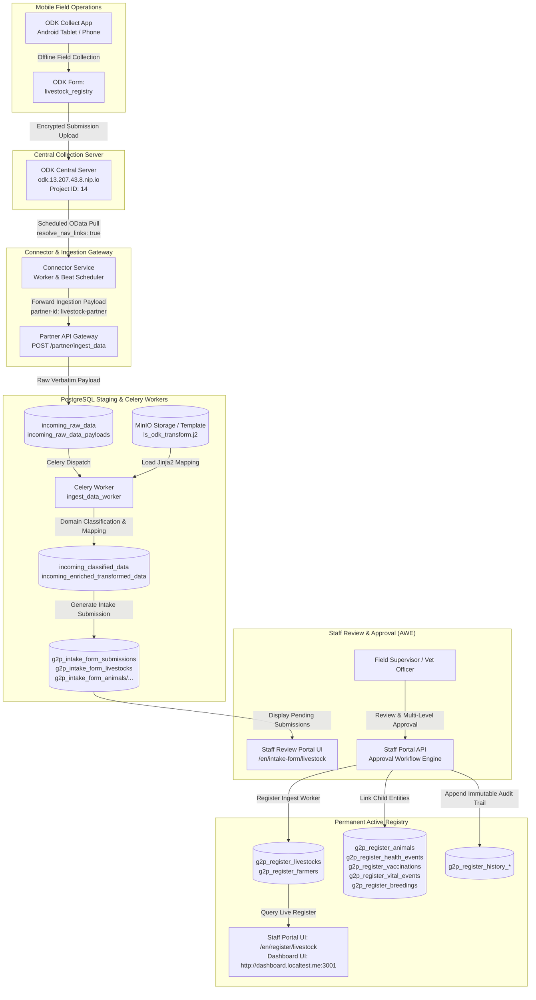

# Livestock Registry

An installable **Livestock Registry** built as a thin extension of the OpenG2P
[registry platform](https://github.com/OpenG2P/registry-platform), following the
same inverted build model as the
[Farmer Registry](https://github.com/OpenG2P/farmer-registry): the platform
publishes the runnable base images and the `openg2p-registry` Helm chart; this
repo adds **only** the livestock domain on top.

The domain is ported from the Odoo module `g2p_livestock_registry`
(`g2p.livestock.registry` and its animal, health, vaccination, vital-event and
breeding lines) onto the platform's register model.

## What this repo owns

| Path | Purpose |
|---|---|
| `livestock-extension/` | The livestock domain package — models, schemas, services, seed metadata (registers, AWE policy, DCI templates) |
| `dashboard-ui/` | The Livestock Registry analytics dashboard — a Next.js app that reads this registry's own tables (see [dashboard-ui/README.md](dashboard-ui/README.md)) |
| `docker/` | Thin Dockerfiles (`FROM openg2p/openg2p-registry-*` + `pip install livestock-extension`) selected at runtime by `REGISTRY_EXTENSION_MODULE` (Option C) |
| `helm/openg2p-livestock-registry/` | A thin wrapper chart: pins `openg2p-registry` as a dependency and supplies the livestock values overlay (no templates) |
| `docker-compose.yml`, `local/` | Docker Compose stack for running the registry on a laptop (`local/` holds its env file and the mock master-data catalog API) |
| `test/sanity/` | The livestock **field-specific** sanity tests (Set 2); the harness + generic tests are inherited from the platform sanity image |

## Registers

Ported from `g2p_livestock_registry`. The livestock holding is the hub: every
line links directly to it, mirroring the module's `line_ids` / `*_event_ids`
one2many fields.

```
Livestock                    farmer identifiers, OAN ID, approval state, source system, sync status
├── Animal                   ear tag, species, breed, sex, age, weight, health & vaccination status
├── HealthEvent              disease/injury/treatment/recovery, onset, resolution, treatment, vet
├── Vaccination              vaccine, vaccination date, next due date, batch, administered by
├── VitalEvent               birth/mortality/disease, cause, offspring count, reporting officer
├── Breeding                 natural or AI, sire/semen, technician, expected calving, outcome
├── VaccineSchedule          vaccine, species, interval in days — drives the next due date
├── ImportBatch              bulk load from DOVAR/LITS/Case Book/ALIVE, row counts, error log
└── AuditLog                 actor, role, action, changes, timestamp, IP, session

Farmer                       farmer_id (FR- + 10 digits) + Fayda FAN, name, sex, contact, geo
                             referenced by the livestock holding
```

The Farmer Registry remains the system of record for people. The `Farmer`
register here holds the identity needed to attach livestock to a person, and the
livestock holding carries the same identifiers (`farmer_uuid`, `farmer_id`,
`fayda_fan_id`, `farmer_name`), mirroring the Fayda FAN into
`link_foundational_id`.

Approval follows the module's four-level ladder — **Kebele → Woreda → Zone →
Region** — seeded as the AWE policy stages in `awe_meta_data/`.

Each register has a `G2PRegister*`, a `G2PRegisterHistory*` and a
`G2PIntakeForm*` model, a matching pydantic schema trio, and a domain service
that validates the domain attributes and builds `search_text` / `record_name`.
Every field, section and tab carries a human-readable label. Species, breed,
vaccine and disease are seeded as attribute lookups — see
[livestock-extension/README.md](livestock-extension/README.md) for the full mapping.

## Run it locally

```bash
docker compose --env-file local/.env up -d --build
```

Then open the **Staff Portal at http://portal.localtest.me:3000** and log in with
`admin` / `admin`.

The stack runs the whole login chain — Keycloak (realm `staff`), the IAM staff
API and master data — alongside the registry, so this is a real OIDC login and
the registry resolves the user's roles into permissions exactly as a deployment
does. Staff API on http://localhost:8001/docs, Partner API on
http://localhost:8002/docs, master data API on http://localhost:8010/docs.
See [local/README.md](local/README.md) for the full service list, why the hosts
are `*.localtest.me` rather than `localhost`, and which integrations are off.

## Dashboard

The portal header carries a **Dashboard** button, left of Configuration, which
opens the Livestock Registry dashboard at
**http://dashboard.localtest.me:3001**. Its own **Back** button returns to the
page the portal was on.

The dashboard is a separate service because the platform ships the Staff Portal
as a finished build that cannot be given new routes — so the button is added to
the published bundle at image build time
(`docker/staff-ui/assets/patch-dashboard-nav.js`) and points at another origin.
It reads the registry database directly and issues nothing but `SELECT`s, so
every panel reflects the records the registry currently holds.

## Deploy

```bash
helm repo add openg2p https://openg2p.github.io/openg2p-helm
helm dependency build ./helm/openg2p-livestock-registry
helm install livestock-registry ./helm/openg2p-livestock-registry \
  --set global.registryHostname=livestock-registry.example.org
```

Set `registry.sanity.runE2e=true` to run the end-to-end sanity suite after install.

## Version pinning

The `openg2p-registry` base image tag (`RP_VERSION` in each Dockerfile) and the
chart dependency version in `helm/openg2p-livestock-registry/Chart.yaml` are
**hardcoded and pinned together**. The livestock images and the wrapper chart are
versioned in lockstep by CI (one version per commit).

To see which version it would pick, run `./scripts/bump-rp-version.sh -n` (dry-run,
writes nothing); `-h` prints help. To apply, run `./scripts/bump-rp-version.sh`
(latest published version) or `./scripts/bump-rp-version.sh <version>` — it updates
the Dockerfiles and the chart dependency together, so they can never drift. A CI
check (`test/test_rp_pin_lockstep.py`) fails the build if they ever do.

---

## ODK & Field Data Collection Integration

The **Livestock Registry** integrates with **ODK Collect** (mobile field app) and **ODK Central** to enable veterinary officers, enumerators, and livestock field agents to capture holding demographics, livestock headcounts, individual animal markings, vaccinations, treatments, vital stats, and breeding records offline in rural areas.

### 1. Overview & Architecture

Field officers collect livestock holding and animal records offline using ODK Collect on mobile devices. Once internet or cellular network connectivity is established, completed submissions are uploaded to ODK Central. The OpenG2P Connector service pulls these submissions via scheduled OData requests, expands nested navigation repeat groups, and forwards canonical JSON payloads to the OpenG2P Partner API for ingestion, Jinja2 template transformation, intake staging, staff review, and live registry commitment.



#### Pipeline Configuration Highlights
* **Form ID**: Single ODK XLSForm `livestock_registry`
* **ODK Central Server**: Project ID `14`, hosted at `odk.13.207.43.8.nip.io`
* **Connector Pipeline**: Pre-configured in `local/postgres/seed_connector_pipelines.sql`
* **Partner API Target**: `http://partner-api:8000/partner/ingest_data` authenticated with header `partner-id: livestock-partner`

---

### 2. Form Assets & Media Files

Data collection uses a single, consolidated ODK XLSForm (`livestock_registry`) with embedded repeating sections.

#### Offline CSV Geographic Lookup Catalogs
The form bundles four CSV lookup files enabling offline cascading geographic selects:

| CSV Catalog File | Geographic Scope | Purpose |
| :--- | :--- | :--- |
| `region.csv` | Regional State | Ethiopian administrative Regions (top-level geography) |
| `zone.csv` | Administrative Zone | Zones within each Region (filtered by selected Region) |
| `woreda.csv` | District / Woreda | Woredas within each Zone (filtered by selected Zone) |
| `kebele.csv` | Sub-district / Kebele | Kebeles within each Woreda (filtered by selected Woreda) |

#### Choice Lists Embedded in the Form
* **Livestock Species Codes**: `cattle`, `sheep`, `goat`, `camel`, `donkey`, `horse`, `mule`, `poultry`, `pig`, `beehive` (mapped to canonical `LIVESTOCK_SPECIES_*` enums).
* **Species-Specific Breeds**:
  * **Cattle**: Begait, Boran, Fogera, Horro, Sheko, Arsi, Barka, Holstein Cross, Jersey Cross, Local Zebu.
  * **Sheep**: Menz, Afar, Blackhead Somali, Horro, Bonga, Washera, Dorper Cross, Local Sheep.
  * **Goat**: Begait, Abergelle, Afar, Boer Cross, Central Highland, Long-eared Somali, Woito-Guji.
  * **Poultry**: Local chicken, Exotic breeds, Cross breeds.
* **Animal Health Status**: `HEALTHY`, `SICK`, `QUARANTINED`, `DECEASED`.
* **Vaccination Status**: `UP_TO_DATE`, `OVERDUE`, `NONE`.
* **Event Locations**: `HOME`, `VETERINARY`, `MARKET`, `FIELD`, `QUARANTINE_CENTER`, `OTHER`.

---

### 3. Livestock Data Structure (Crucial)

The Livestock Registry implements a **hub-and-spoke model** where the `Livestock` holding is the root anchor linking the farmer, geographic location, holding headcounts, and all child event entities:

```text
Livestock (Root Holding)
├── Farmer Identity         (fayda_fan_id, farmer_id, farmer_name, gender, DOB, mobile, registration_date)
├── Farmer Location         (region, zone, woreda, kebele)
├── Survey Personnel        (surveyor name/mobile, supervisor name/mobile)
├── Animal Details          (ear_tag_id, species, breed, colour, weight, gender, DOB, age, health_status, vaccination_status)
│   ├── Health Events       (event_type, disease_type, date_onset, date_resolution, treatment, vet, is_notifiable, location)
│   ├── Vaccinations        (vaccine_type, vaccination_date, next_due_date, batch_number, administered_by)
│   ├── Vital Events        (event_type [BIRTH/MORTALITY/DISEASE], event_date, cause, offspring_count, reporting_officer)
│   └── Breeding Events     (event_type [NATURAL/AI], breeding_date, sire_or_semen_id, ai_technician, expected_calving_date, outcome)
└── Audit Log               (actor, role, action, changes, timestamp)
```

#### Jinja2 Transformation (`ls_odk_transform.j2`)
The Jinja2 template maps incoming ODK submission JSON payloads into standard OpenG2P intake form sections:

1. `ls_farmer_identity`: Extracts farmer demographic data (`farmer_name`, `fayda_fan_id`, `farmer_id`, `gender`, `date_of_birth`, `phone_number`).
2. `ls_farmer_location`: Geographic location coordinates and names for the farmer.
3. `ls_survey_personnel`: Enumerator and supervisor names and contact numbers.
4. `ls_livestock_record`: Root holding record containing holding totals (`total_animals`), status, and metadata.
5. `ls_livestock_location`: Physical holding location coordinates and administrative division.
6. `ls_animal_details`: Individual animal records unpacked from the `livestock` repeat group (`ear_tag_id`, `species`, `breed`, `gender`, `age`, `colour`, `weight`, `health_status`, `vaccination_status`).
7. `ls_health_event_details`: Child treatments and diagnoses unpacked from nested `livestock[].health_events[]`.
8. `ls_vaccination_details`: Child vaccinations unpacked from nested `livestock[].vaccinations[]`.
9. `ls_vital_event_details`: Life events (births, deaths, mortality reasons) unpacked from nested `livestock[].vital_events[]`.
10. `ls_breeding_details`: Insemination and natural service records unpacked from nested `livestock[].breeding_events[]`.

#### Advanced Template Normalization
* **Species Mapping**: Normalizes colloquial/ODK text names (`cow`, `bovine`, `cattle` ➔ `LIVESTOCK_SPECIES_CATTLE`, `sheep`, `ovine` ➔ `LIVESTOCK_SPECIES_SHEEP`, `goat`, `caprine` ➔ `LIVESTOCK_SPECIES_GOAT`, `chicken`, `poultry` ➔ `LIVESTOCK_SPECIES_POULTRY`, `camel` ➔ `LIVESTOCK_SPECIES_CAMEL`, `donkey` ➔ `LIVESTOCK_SPECIES_DONKEY`, `horse` ➔ `LIVESTOCK_SPECIES_HORSE`, `mule` ➔ `LIVESTOCK_SPECIES_MULE`, `pig` ➔ `LIVESTOCK_SPECIES_PIG`, `beehive` ➔ `LIVESTOCK_SPECIES_BEEHIVE`).
* **Breed Mapping**: Nested per-species `if/elif` chains resolving raw breed identifiers into official `LIVESTOCK_BREED_*` enum codes.
* **Vaccine Type Normalization**: Maps over 30 veterinary vaccine codes, including species-specific Anthrax, Pasteurellosis, Blackleg, CBPP, CCPP, FMD, LSD, Brucellosis, Rabies, PPR, SGP, Enterotoxaemia, Camel Pox, Newcastle Disease, Gumboro, Fowl Typhoid/Pox, Marek's Disease, African Horse Sickness (AHS), and Tetanus.
* **Administrative Region Resolution**: Converts snake_case ODK option codes into proper display names (e.g., `central_ethiopia` ➔ `Central Ethiopia`, `south_west` ➔ `South West`, `gambela` ➔ `Gambela`).

---

### 4. Approval Workflow

The Livestock Registry enforces a **four-level approval ladder** governed by the Approval Workflow Engine (AWE):

$$\text{DRAFT} \longrightarrow \text{KEBELE\_APPROVED} \longrightarrow \text{WOREDA\_APPROVED} \longrightarrow \text{ZONE\_APPROVED} \longrightarrow \text{VERIFIED}$$

* **Workflow Stages**:
  1. `DRAFT`: Initial state upon ingestion into the intake queue.
  2. `KEBELE_APPROVED`: Kebele development agent / livestock officer approval.
  3. `WOREDA_APPROVED`: Woreda veterinary supervisor sign-off.
  4. `ZONE_APPROVED`: Zonal livestock expert validation.
  5. `VERIFIED`: Final verification promoting holding and animals into the active register.
* **Archival**: Inactive or retired holdings transition to `ARCHIVED` status.
* **Policy Seed**: Defined in `awe_meta_data/` policy configurations matching `LivestockStateEnum`.

---

### 5. Server & Production Ingestion Setup

#### Ingestion Architecture: Scheduled OData Pull
The OpenG2P Connector Service (`connector-api` and `connector-worker`) orchestrates periodic synchronization from ODK Central:

1. **OData Endpoint**: Connects to `https://odk.13.207.43.8.nip.io/v1/projects/14/forms/livestock_registry.svc`.
2. **Repeat Group Expansion (`resolve_nav_links: true`)**:
   * ODK Central represents nested repeating sub-tables as `@odata.navigationLink` URLs.
   * The connector recursively navigates each link (`livestock`, `health_events`, `vaccinations`, `vital_events`, `breeding_events`) and injects the child rows into the payload before posting to OpenG2P.
3. **Target Ingestion Endpoint**: Posts transformed JSON payloads to:
   ```text
   http://partner-api:8000/partner/ingest_data
   ```
   with request header `partner-id: livestock-partner`.
4. **CSRF Bypass**: Automated webhook and ingestion endpoints must bypass browser CSRF checks by using the Partner API Gateway or by including the URI path in `REGISTRY_STAFF_CSRF_EXCLUDED_PATHS`.
5. **Connector Seed**: The polling pipeline definition is maintained in `local/postgres/seed_connector_pipelines.sql`.

---

### 6. Staging, Validation & Audit Trail Pipeline

Incoming livestock submissions move sequentially through transactional staging tables:

```text
[ODK Central]
      │
      ▼
incoming_raw_data                  <-- Records payload arrival, correlation ID, partner ID
incoming_raw_data_payloads         <-- Stores raw verbatim JSON payload
      │
      ▼ (Celery ingest_data_worker + ls_odk_transform.j2)
incoming_classified_data           <-- Stores validated livestock domain model
incoming_enriched_transformed_data <-- Stores OpenG2P intake schema JSON
      │
      ▼
g2p_intake_form_submissions        <-- Staged submission in PENDING approval status
g2p_intake_form_livestocks         <-- Staged root livestock holding
g2p_intake_form_animals / ...      <-- Staged animal and event records
      │
      ▼ (Staff Review & AWE Approval)
g2p_register_livestocks            <-- Active root livestock holding record
g2p_register_farmers               <-- Registered farmer identity associated with the holding
g2p_register_animals               <-- Active individual animal records (ear tags)
g2p_register_health_events         <-- Health and veterinary event records
g2p_register_vaccinations          <-- Animal immunization records
g2p_register_vital_events          <-- Birth, death, and mortality records
g2p_register_breedings             <-- Artificial insemination and breeding events
g2p_register_history_*             <-- Immutable audit trail capturing full change snapshots
```

#### Staff Portal Interfaces
* **Intake Submissions Review**: `/en/intake-form/livestock`
* **Live Livestock Registry**: `/en/register/livestock`
* **Farmer Registry**: `/en/register/farmer`
* **Analytics Dashboard**: `http://dashboard.localtest.me:3001`

---

### 7. Testing & Troubleshooting DevOps Playbook

#### Ingesting a Test Payload via cURL
To simulate an ODK submission directly into the Partner API:

```bash
curl -X POST http://localhost:8002/partner/ingest_data \
  -H "Content-Type: application/json" \
  -H "partner-id: livestock-partner" \
  -d '{
    "form_id": "livestock_registry",
    "submission_id": "uuid:f77855f6-79bd-4fec-8d74-5b68e9ece010",
    "submit_date_time": "2026-09-23T08:00:00Z",
    "farmer_name": "Chris Hems Worth",
    "farmer_id": "FR-8888881111",
    "fayda_fan_id": "FAN-8888811111555555",
    "region": "gambela",
    "zone": "majang",
    "woreda": "mengesh",
    "kebele": "aligenda",
    "surveyor_name": "Abebe Bikila",
    "surveyor_mobile_number": "+251911223344",
    "livestock": [
      {
        "ear_tag_id": "ET8888800000",
        "species": "poultry",
        "breed": "local",
        "gender": "FEMALE",
        "age": 1,
        "health_status": "HEALTHY",
        "vaccination_status": "UP_TO_DATE",
        "vaccinations": [
          {
            "vaccine_type": "lsd",
            "vaccination_date": "2026-09-20",
            "administered_by": "Dr. Dawit"
          }
        ]
      }
    ]
  }'
```

#### Monitoring Celery Worker & Connector Logs

```bash
# Monitor Celery worker processing & transformation logs
docker logs -f livestock-celery-worker-1

# Monitor connector OData polling and dispatch
docker logs -f livestock-connector-worker-1

# Inspect latest intake submissions in PostgreSQL
docker exec -i livestock-postgres-1 psql -U postgres -d livestock -c \
  "SELECT submission_id, application_reference, approval_status, register_ingest_process_status \
   FROM g2p_intake_form_submissions ORDER BY first_created_at DESC LIMIT 5;"

# Check live register entries
docker exec -i livestock-postgres-1 psql -U postgres -d livestock -c \
  "SELECT internal_record_id, functional_record_id, farmer_name, total_animals, region, woreda \
   FROM g2p_register_livestocks ORDER BY created_at DESC LIMIT 5;"
```

#### Syncing Updated Jinja2 Templates to MinIO

```bash
# Copy updated template into MinIO container
docker cp livestock-extension/src/openg2p_registry_livestock_extension/templates/ls_odk_transform.j2 \
  livestock-minio-1:/tmp/ls_odk_transform.j2

# Push template to MinIO storage bucket
docker exec -i livestock-minio-1 mc cp /tmp/ls_odk_transform.j2 local/templates/dci_to_openg2p_livestock.json.j2

# Restart Celery worker to flush template cache
docker restart livestock-celery-worker-1
```

#### Common Issues & Troubleshooting Checklist

| Issue | Root Cause | Resolution |
| :--- | :--- | :--- |
| **`403 Forbidden: CSRF token missing or invalid`** | Submitting directly to Staff API endpoints without active browser session cookies. | Send payloads to the Partner API gateway (`/partner/ingest_data`) with header `partner-id: livestock-partner`, or add path to `REGISTRY_STAFF_CSRF_EXCLUDED_PATHS`. |
| **Species or Breed Not Mapping in Dropdowns** | ODK submission contained untracked string variation or typo. | Update the species mapping dictionary and breed `if/elif` resolution blocks in `ls_odk_transform.j2`. |
| **Unexpanded Repeat Navigation Links** | Connector returned `@odata.navigationLink` URL strings rather than nested lists. | Ensure `"resolve_nav_links": true` is configured in `source_config_json` in `local/postgres/seed_connector_pipelines.sql`. |
| **Vaccine Type Not Recognized** | The vaccine identifier does not match standard codes. | Check `ls_odk_transform.j2` vaccine mapping to verify the code is mapped to the corresponding `VACCINE_TYPE_*` enum. |
| **Empty Animal Details in Live Register** | The `livestock` repeat group was omitted or empty in the ODK submission payload. | Confirm that field enumerators filled the animal repeating section and that ODK form constraints require at least one entry. |
| **Approval State Mismatch** | Custom workflow stages do not align with system definitions. | Ensure AWE policy stages configured in `awe_meta_data/` strictly mirror the `LivestockStateEnum` ladder (`DRAFT` ➔ `KEBELE_APPROVED` ➔ `WOREDA_APPROVED` ➔ `ZONE_APPROVED` ➔ `VERIFIED`). |

---

See the deployment & extension docs at [docs.openg2p.org](https://docs.openg2p.org).

