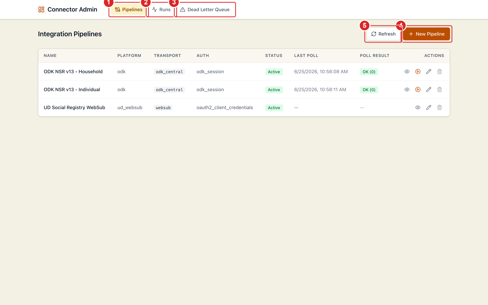
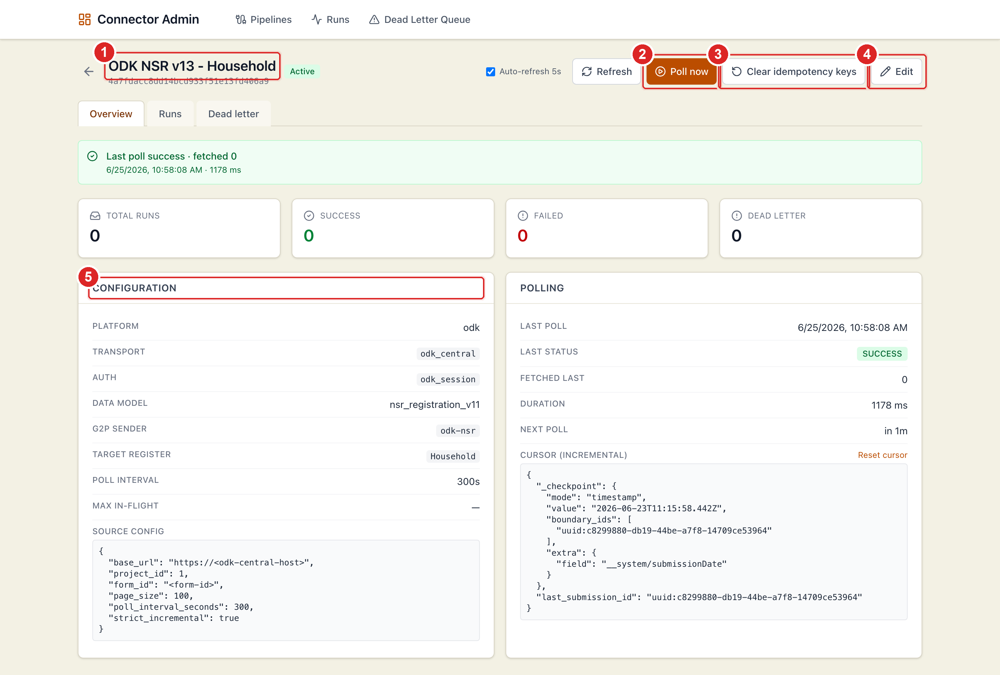
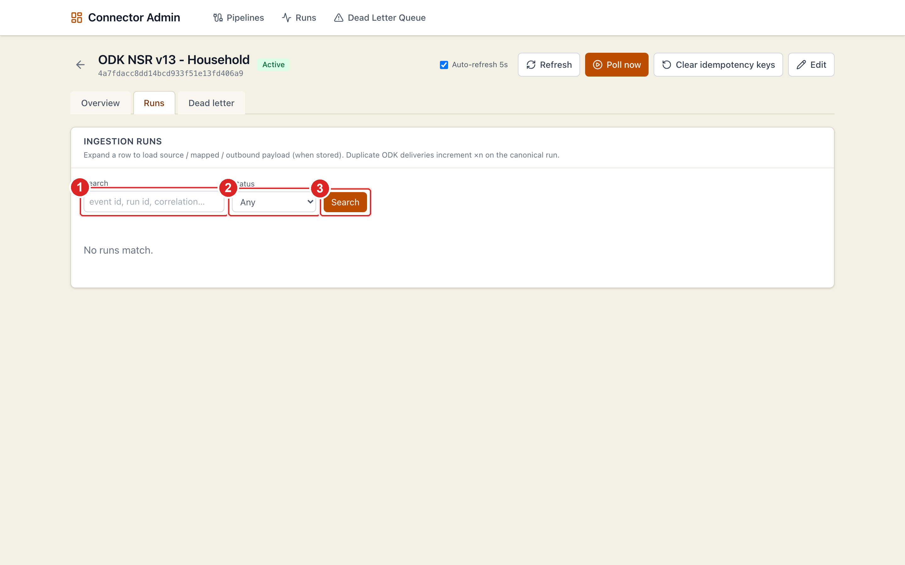
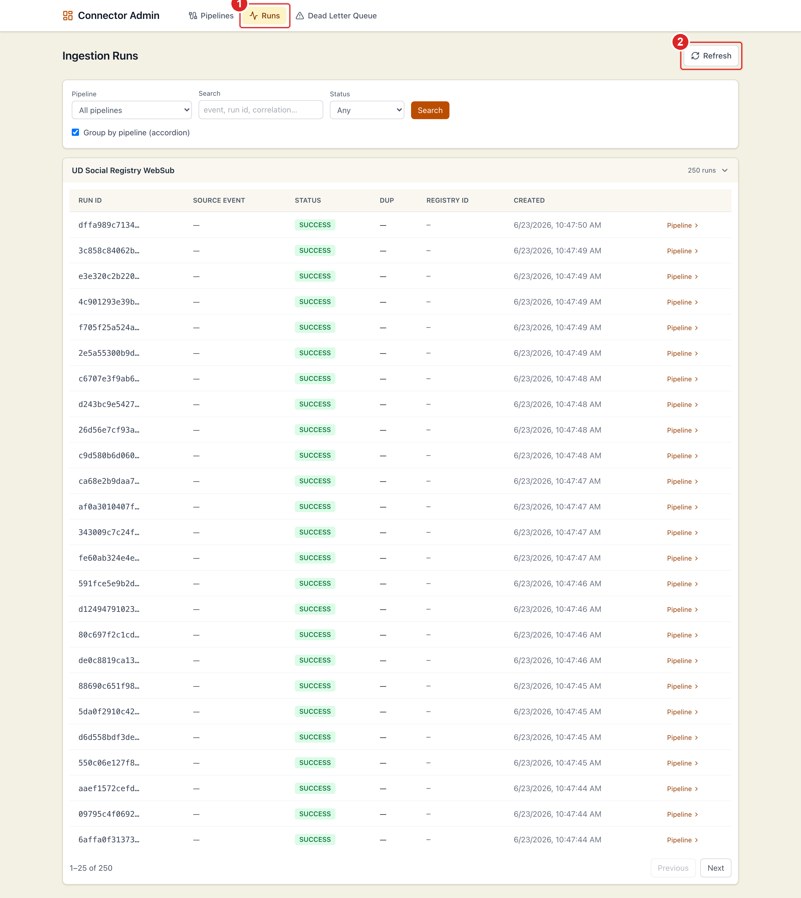
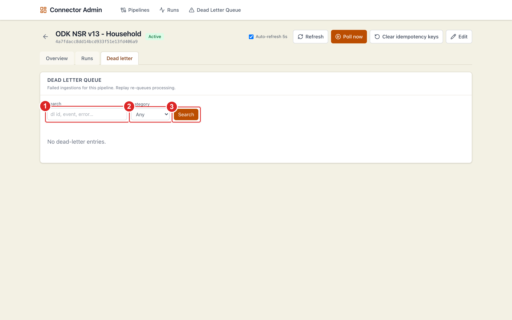
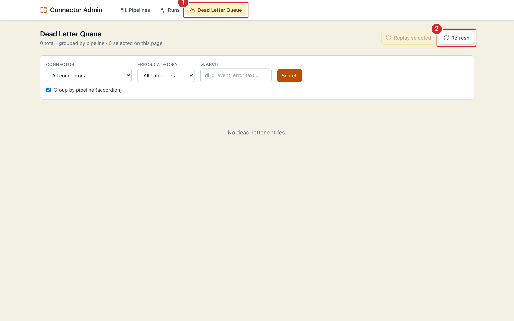
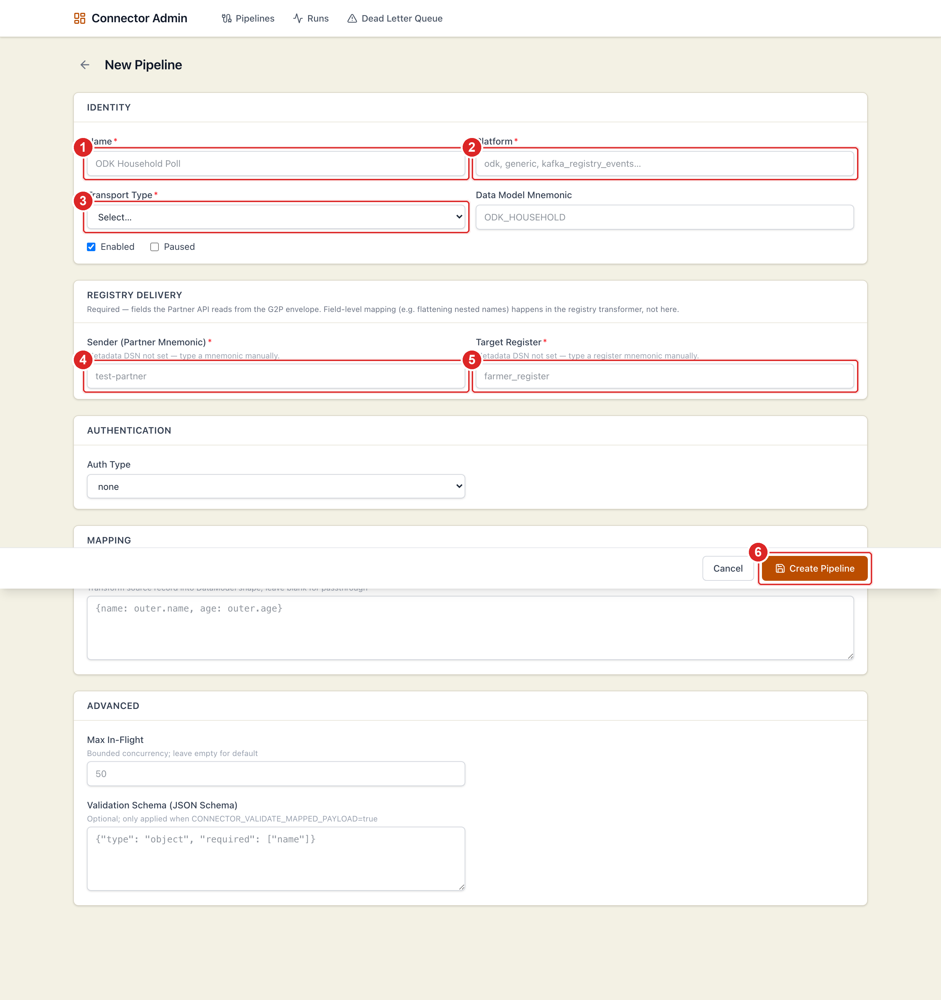
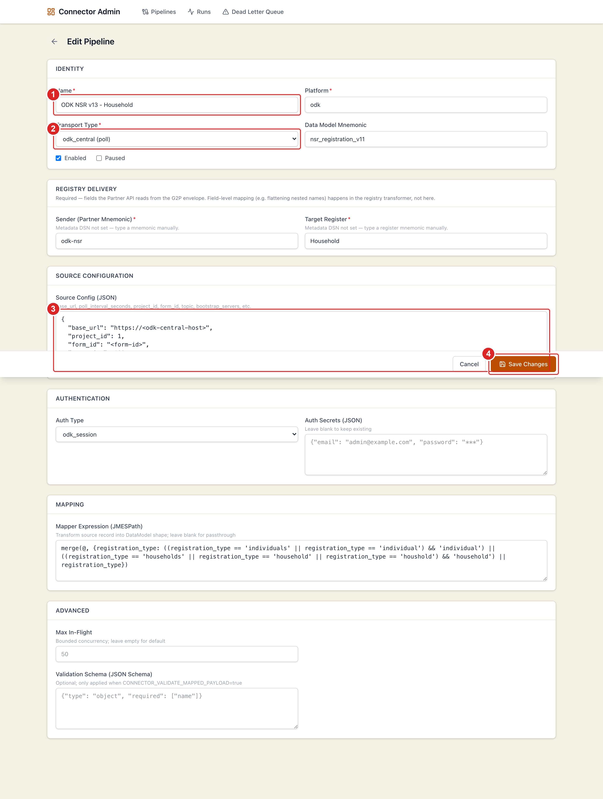
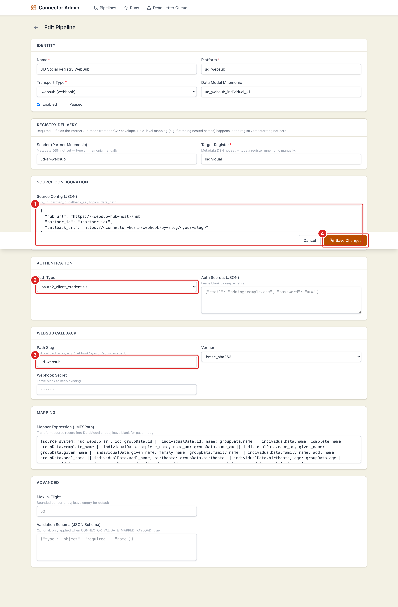

# OpenG2P Connector User Manual

## Connector Admin — configure, navigate, and operate

### Document control

| Field | Value |
| ----- | ----- |
| Document type | User manual |
| Product | OpenG2P Connector Service + Connector Admin UI |
| Audience | Integration operators, registry administrators, support staff |
| Scope | How to access, navigate, configure, and operate integration pipelines |
| Version | 1.1 |

### Revision history

| Version | Date | Summary |
| ------- | ---- | ------- |
| 1.0 | 2026 | Initial release with annotated screenshots. |
| 1.1 | 2026 | Environment-agnostic rewrite; element-aligned annotations; task-oriented walkthroughs. |

### How to use this manual

This manual explains how to operate the **Connector Admin** web application that manages integration pipelines between external data sources and the OpenG2P Registry. Each screen is shown with **numbered red markers**; the meaning of each number is listed in the caption directly beneath the figure, so you can match what you see on screen to the instructions.

Wherever a host or address is needed, this manual uses a placeholder such as `https://<connector-host>/`. Replace it with the actual address provided by your administrator. No environment-specific URLs are assumed.

---

## 1. Introduction

### 1.1 What the connector does

The OpenG2P Connector is a multi-transport integration gateway. It ingests data from external platforms and delivers it to the OpenG2P Registry through the Partner API. You use the Connector Admin UI to define **pipelines** — each pipeline describes one data source, how to authenticate to it, how to transform records, and which registry to deliver them to.

### 1.2 Transport types

A pipeline's **transport** determines how data arrives:

| Transport | Pattern | How data arrives |
| --------- | ------- | ---------------- |
| `odk_central` | Poll | The connector polls ODK Central on a schedule and fetches new submissions incrementally. |
| `webhook` | Push | An external system posts JSON to a connector URL. |
| `websub` | Push (pub/sub) | A WebSub hub notifies the connector when a subscribed topic publishes an event. |
| `kafka` / `rabbitmq` / `sqs` | Consumer | A background consumer reads messages from a topic or queue (when enabled). |

### 1.3 Components

| Component | Role |
| --------- | ---- |
| **Connector Admin UI** | The web application described in this manual: create, edit, and monitor pipelines. |
| **Connector Service API** | Backend that stores pipeline definitions, runs ingestion, and exposes REST endpoints. |
| **Background workers** | Scheduled polls and asynchronous processing of pushed events. |
| **Registry Partner API** | The delivery target that receives normalized records and creates registry change requests. |

### 1.4 Key concepts

| Term | Meaning |
| ---- | ------- |
| **Pipeline** | A connector definition: source, transport, authentication, mapping, and registry delivery. |
| **Run** | One ingestion attempt for a single source record/event. |
| **Sender (partner mnemonic)** | Identifies your integration to the registry; must match a registered partner. |
| **Target register** | The registry your records are delivered into (for example an individual or household register). |
| **Mapper (JMESPath)** | An expression that reshapes a source record before delivery. |
| **Cursor / checkpoint** | Saved poll position so each poll only fetches new records. |
| **Idempotency key** | A dedupe key derived from the source event so the same record is not ingested twice. |
| **DLQ** | Dead Letter Queue — failed ingestions that you can inspect and replay. |

---

## 2. Accessing the Connector Admin

### 2.1 Open the portal

1. Open a current browser (Chrome, Edge, or Firefox).
2. Go to the connector portal address provided by your administrator: `https://<connector-host>/`.
3. The **Integration Pipelines** page loads (Figure 1).

The Connector Admin UI does not show its own login screen — access is controlled at the network or gateway layer (VPN, single sign-on, or network policy). If the page does not load, confirm your network access and that the service is running.

### 2.2 Connection status

A status indicator below the header shows whether the browser can reach the Connector Service API. If it reports an error, verify the portal address, your network/VPN, and with your administrator that the backend is healthy.

---

## 3. Navigation overview

The header has three areas. Use them to move between the main parts of the application.



**Figure 1.** Integration Pipelines (home).
**(1)** *Pipelines* — list and manage all pipelines.
**(2)** *Runs* — ingestion activity across every pipeline.
**(3)** *Dead Letter Queue* — failed ingestions, with replay.
**(4)** *New Pipeline* — create a pipeline.
**(5)** *Refresh* — reload the list.

### 3.1 Pipeline list columns

| Column | Meaning |
| ------ | ------- |
| **Name** | Pipeline name; click to open its detail page. |
| **Platform** | Source platform label (for example `odk`). |
| **Transport** | Technical transport (`odk_central`, `websub`, `webhook`, …). |
| **Auth** | Authentication strategy in use. |
| **Status** | Active, Paused, or Disabled. |
| **Last Poll** | Time of the most recent poll (poll transports only). |
| **Poll Result** | Outcome of the last poll (OK / Partial / Failed) with record count. |
| **Actions** | View, Poll now, Edit, Delete. |

The **Poll now** action appears only for poll-based pipelines. Push pipelines (webhook, WebSub) receive events and have no poll action.

---

## 4. Viewing a pipeline

Click a pipeline name (or the view icon) to open its detail page.



**Figure 2.** Pipeline overview.
**(1)** Title, connector ID, and status badge.
**(2)** *Poll now* — trigger an immediate poll (poll transports).
**(3)** *Clear idempotency keys* — allow previously seen records to be processed again (use with care).
**(4)** *Edit* — open the configuration form.
**(5)** *Configuration* panel — transport, auth, sender, target register, and parsed source config.

### 4.1 What the overview shows

- **KPI cards:** total runs, successes, failures, and dead-letter count.
- **Latest run:** the most recent ingestion with its status and registry correlation ID.
- **Configuration panel:** platform, transport, auth type, data model, sender, target register, poll interval, and source config.
- **Polling panel** (poll pipelines): last poll time, status, fetched count, duration, next poll, and the incremental **cursor** (with a *Reset cursor* control).
- **Push pipelines** show the inbound URL instead, in the form `POST /webhook/by-slug/<your-slug>`.

### 4.2 Action buttons

| Button | Use it to |
| ------ | --------- |
| **Auto-refresh 5s** | Keep the page updating while you watch a poll or replay. |
| **Refresh** | Reload stats once. |
| **Poll now** | Poll the source immediately (poll transports). |
| **Sync hub subscriptions** | WebSub only — register topics and subscribe the callback URL at the hub. |
| **Clear idempotency keys** | Re-allow previously processed records (testing/replay; avoid in production). |
| **Edit** | Change the pipeline configuration. |

---

## 5. Monitoring ingestion runs

### 5.1 Runs for one pipeline

Open a pipeline, then select the **Runs** tab.



**Figure 3.** Pipeline runs.
**(1)** Search by event ID, run ID, or correlation ID.
**(2)** Filter by status.
**(3)** Apply the search.

Each row shows the run ID, source event, status, duplicate count, registry ID, and last activity. Expand a row (chevron at the left) to inspect the stored payload when payload storage is enabled.

### 5.2 Runs across all pipelines

Select **Runs** in the header to see activity from every pipeline in one place.



**Figure 4.** Global runs.
**(1)** The active *Runs* section.
**(2)** *Refresh*.
Use the filters to choose a pipeline, search, filter by status, or toggle grouping by pipeline. This view answers “did anything fail recently, anywhere?”

---

## 6. Dead letter queue (DLQ)

Ingestions that fail and cannot be retried automatically are stored in the **Dead Letter Queue** so you can inspect and replay them.

### 6.1 DLQ for one pipeline

Open a pipeline, then select the **Dead letter** tab.



**Figure 5.** Pipeline dead letter queue.
**(1)** Search dead-letter entries.
**(2)** Filter by error category.
**(3)** Apply the search.

### 6.2 DLQ across all pipelines

Select **Dead Letter Queue** in the header.



**Figure 6.** Global dead letter queue.
**(1)** The active *Dead Letter Queue* section.
**(2)** *Refresh*.
Each entry can be replayed; expand it to read the error and payload.

### 6.3 Error categories

| Category | Typical cause | Action |
| -------- | ------------- | ------ |
| `transient` | Network timeout / target briefly unavailable | Replay; it often succeeds. |
| `permanent` | Unrecoverable source or registry rejection | Fix the data/config, then replay. |
| `validation` | Mapped record failed schema validation | Correct the mapping or schema. |
| `config` | Missing sender, register, or mapper error | Fix the pipeline configuration. |

---

## 7. Creating a pipeline

Click **New Pipeline** on the home page.



**Figure 7.** New pipeline — required fields.
**(1)** *Name*.
**(2)** *Platform*.
**(3)** *Transport Type*.
**(4)** *Sender (partner mnemonic)*.
**(5)** *Target Register*.
**(6)** *Create Pipeline* (sticky footer).

Fill the form section by section.

### 7.1 Identity

| Field | Required | Description |
| ----- | -------- | ----------- |
| **Name** | Yes | Display name in the pipeline list. |
| **Platform** | Yes | Logical platform key (for example `odk`, `generic`). |
| **Transport Type** | Yes | How records are received (poll, webhook, consumer, or WebSub). |
| **Data Model Mnemonic** | No | Optional semantic label used by registry transformers. |
| **Enabled** | — | When off, the pipeline neither polls nor accepts pushes. |
| **Paused** | — | Temporarily stop processing without deleting the pipeline. |

### 7.2 Registry delivery

These fields populate the envelope sent to the registry.

| Field | Required | Description |
| ----- | -------- | ----------- |
| **Sender (Partner Mnemonic)** | Yes | Must match a registered partner in the registry. |
| **Target Register** | Yes | The register mnemonic to deliver into. |

When the service has registry metadata configured, these appear as dropdowns; otherwise type the mnemonic.

### 7.3 Source configuration (JSON)

Transport-specific connection details. Replace placeholders with your own values.

**ODK Central (poll):**

```json
{
  "base_url": "https://<odk-central-host>",
  "project_id": 1,
  "form_id": "<form-id>",
  "page_size": 100,
  "poll_interval_seconds": 300,
  "strict_incremental": true
}
```

**WebSub (push):**

```json
{
  "hub_url": "https://<websub-hub-host>/hub",
  "partner_id": "<partner-id>",
  "callback_url": "https://<connector-host>/webhook/by-slug/<your-slug>"
}
```

### 7.4 Authentication

| Auth type | Use for | Secrets (JSON) |
| --------- | ------- | -------------- |
| `none` | Public endpoints | — |
| `odk_session` | ODK Central | `{"email": "...", "password": "..."}` |
| `oauth2_client_credentials` | OAuth-protected hubs/APIs | `{"token_url": "...", "client_id": "...", "client_secret": "..."}` |

Secrets are **write-only**: the UI never displays stored credentials after you save.

### 7.5 Webhook / WebSub

Shown for `webhook` and `websub` transports.

| Field | Description |
| ----- | ----------- |
| **Path Slug** | URL alias: `/webhook/by-slug/<your-slug>`. |
| **Verifier** | Signature algorithm used to validate inbound requests. |
| **Webhook Secret** | Shared secret for signature verification. |

### 7.6 Mapping and advanced options

| Field | Description |
| ----- | ----------- |
| **Mapper Expression (JMESPath)** | Reshape each source record before delivery; leave blank for passthrough. |
| **Max In-Flight** | Limit concurrent ingestions for the pipeline. |
| **Validation Schema** | Optional JSON Schema enforced when validation is enabled on the service. |

Click **Create Pipeline** to save.

---

## 8. Editing a pipeline

From the list or detail page, click **Edit**.



**Figure 8.** Edit pipeline.
**(1)** *Name* (identity).
**(2)** *Transport Type*.
**(3)** *Source Config* (JSON).
**(4)** *Save Changes*.

WebSub and webhook pipelines show additional sections for the callback and authentication:



**Figure 9.** Edit a WebSub pipeline.
**(1)** *Source Config* — hub URL, partner ID, callback URL, topics.
**(2)** *Auth Type* — for example OAuth2 client credentials.
**(3)** *Path Slug* — the callback alias.
**(4)** *Save Changes*.

**Important:** leave **Auth Secrets** and **Webhook Secret** blank when editing unless you intend to replace them — blank means “keep the existing secret.”

After saving, return to the detail page and use **Sync hub subscriptions** (WebSub) or **Poll now** (poll transports) to verify the change.

---

## 9. Common operator tasks

### 9.1 Trigger an immediate poll

1. Open **Pipelines** and locate the poll-based pipeline.
2. Click the **Poll now** (play) icon in *Actions*, or open the pipeline and click **Poll now**.
3. A confirmation shows the background task ID.
4. Open the **Runs** tab or enable **Auto-refresh** to watch progress.

### 9.2 Subscribe WebSub topics at the hub

1. Open the WebSub pipeline.
2. Click **Sync hub subscriptions**.
3. Review the result — each topic shows its register and subscribe status.
4. If a subscription fails, verify the hub URL, callback URL, credentials, and that the callback is reachable from the hub.

### 9.3 Investigate and recover a failure

1. In the pipeline **Runs** tab, look for `FAILED` runs and expand a row to read the error.
2. If the entry is in the DLQ, open the **Dead letter** tab (or the global queue).
3. Fix the root cause (mapping, sender, target register, or source data).
4. Click **Replay** on the entry.

### 9.4 Re-process historical records

1. Open the poll pipeline’s detail page.
2. In the **Polling** panel, click **Reset cursor** and confirm.
3. Click **Poll now** (or wait for the next scheduled poll). The next poll re-fetches from the start.

### 9.5 Pause without deleting

1. Click **Edit**.
2. Check **Paused** and save. Processing stops until you clear it.

---

## 10. Troubleshooting

| Symptom | Likely cause | What to do |
| ------- | ------------ | ---------- |
| Page shows an API connection error | Network / gateway / service down | Verify the portal address, VPN, and service health. |
| Poll result **Failed** | Bad credentials, wrong URL, or timeout | Check auth secrets, `base_url`, and the last poll error on the overview. |
| Poll **OK** but 0 fetched | Cursor already up to date | Normal when there are no new records. |
| WebSub events not arriving | Hub subscription missing or callback unreachable | Run **Sync hub subscriptions**; confirm the callback URL is reachable. |
| Registry rejects records | Wrong sender or target register | Confirm the partner exists and the register mnemonic matches the registry. |
| Duplicate records after replay | Idempotency keys were cleared | Avoid clearing idempotency keys in production unless intentional. |
| Runs payload empty | Payload storage disabled | Ask an administrator to enable run payload storage. |

---

## 11. Glossary

| Term | Definition |
| ---- | ---------- |
| **Pipeline** | A connector definition: source, transport, mapping, and registry delivery. |
| **Run** | A single ingestion attempt for one source event. |
| **Envelope** | The wrapper sent to the registry containing sender, register, and payload. |
| **JMESPath** | Query language used for mapper expressions. |
| **DLQ** | Dead Letter Queue — failed ingestions eligible for replay. |
| **Idempotency key** | Dedupe key preventing the same record from being ingested twice. |
| **Cursor / checkpoint** | Saved poll position for incremental fetching. |
| **WebSub** | Publish/subscribe protocol where a hub pushes notifications to a callback URL. |

---

## 12. Related documentation

| Resource | Where |
| -------- | ----- |
| OpenG2P platform documentation | <https://docs.openg2p.org/> |
| OpenG2P Registry | <https://docs.openg2p.org/products/registry> |
| Connector Service (source) | `openg2p-connector-service` repository README |
| Connector Admin UI (source) | `openg2p-connector-ui` repository README |

---

*End of document.*
